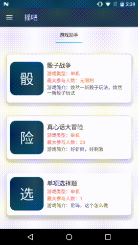

# Shakeba

## 项目简介

- 功能介绍

	摇吧是一款基于手机摇一摇功能的小游戏或者游戏助手集合。目前摇吧已经支持骰子战争、真心话大冒险等游戏。摇吧中，所有游戏的使用方法都是摇一摇，打开手机摇一摇，体验摇吧带来的乐趣吧！

-  代码介绍

	摇吧是一款基于Android + PHP开发的小游戏工具集，基本遵守Google的Material Design设计规范。具体开发中用到了网络交互、数据库交互等功能模块。

### 下载地址

- 扫码下载

- 应用宝官网下载

	[http://sj.qq.com/myapp/detail.htm?apkName=com.bihe0832.shakeba](http://sj.qq.com/myapp/detail.htm?apkName=com.bihe0832.shakeba)

- **备注：**

	**由于目前1.2 版本存在OOM的问题因此还没有发布，所有对外下载地址都只能下载到1.1.0版本。1.2版本请点击链接[摇吧1.2开发版下载地址](https://github.com/bihe0832/Shakeba/blob/master/Server/download/shakeba-release-1.2.0pre-20170208.apk)下载。**

### 运行方法

如何修改配置及运行工程，请参考本人博客：[终端基于gradle的开源项目运行环境配置指引](
https://blog.bihe0832.com/android-as-gradle-config.html)

### 官网

- 应用网站：[http://shakeba.bihe0832.com/](http://shakeba.bihe0832.com/)

- 应用宝介绍页：[http://sj.qq.com/myapp/detail.htm?apkName=com.bihe0832.shakeba](http://sj.qq.com/myapp/detail.htm?apkName=com.bihe0832.shakeba)

### 相关文档

- 摇吧—来到摇吧，那就摇吧：[https://blog.bihe0832.com/shakeba.html](https://blog.bihe0832.com/shakeba.html)

- 如何随apk一起打包并使用SQLite：[https://blog.bihe0832.com/sqlite-raw-db.html](https://blog.bihe0832.com/sqlite-raw-db.html) 

- 封装HttpURLConnection实现的简单的网络请求库：[https://github.com/bihe0832/Android-HttpURLConnection](https://github.com/bihe0832/Android-HttpURLConnection)
### Demo效果

## 其他

因为工作的原因，断断续续写了很久，很多想尝试的都没有搞定。后续可能因为工作的原因更新会更慢，因此就决定先丢到这里~

### 待完成内容

下面列举一些目前想到的待完成的工作项，陆续填坑~

#### 功能待完善

- 更多翻卡片类型游戏待添加
	- 做家务
	- 打情骂俏
	- 每日占卜、运势
	- 石头剪刀布 
- 增加一个计时器
- 添加新手指引及应用启动动画

#### 项目待完善

- 版本号自动管理
- 新版本较频繁的OOM待处理
- 官网帮助等文字信息与APK的自动同步
- 写几篇博客，整理设计及开发思路
- Server早期放在SAE，所以有很多SAE相关的代码，待删除

